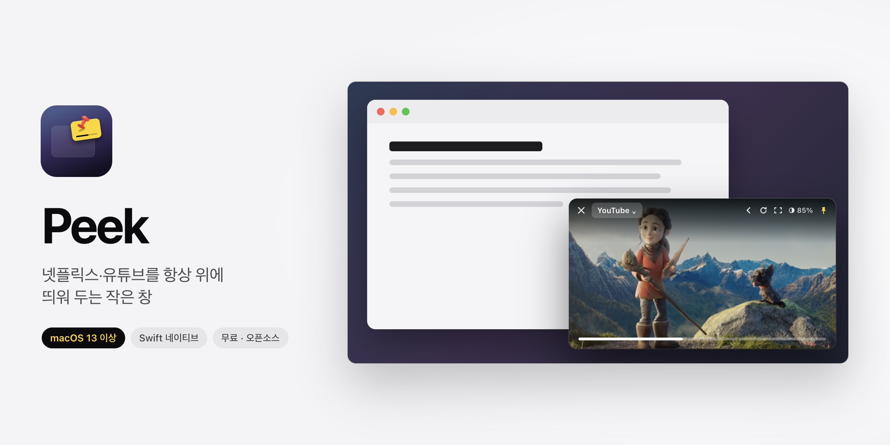
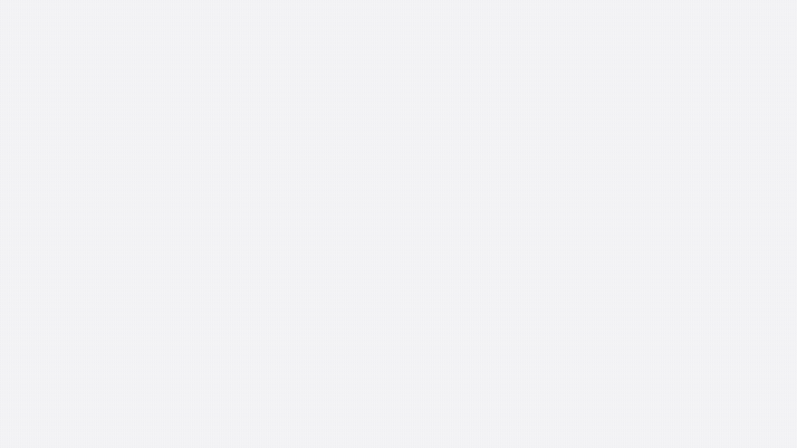
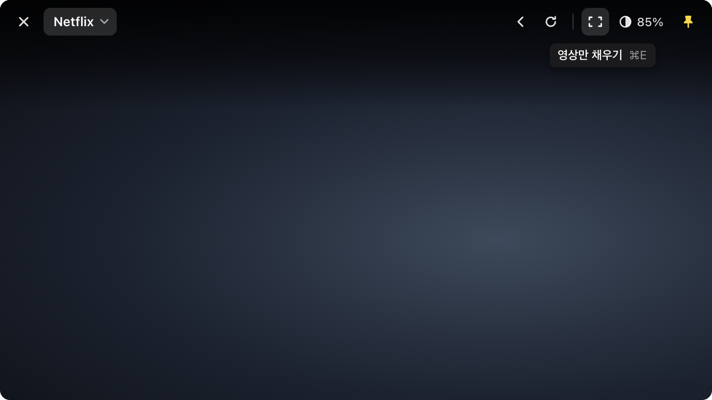
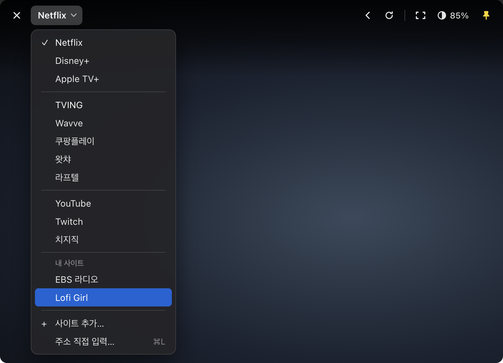
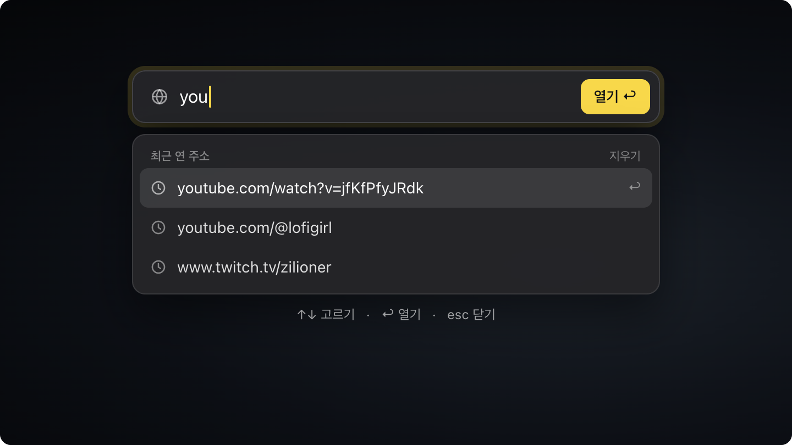
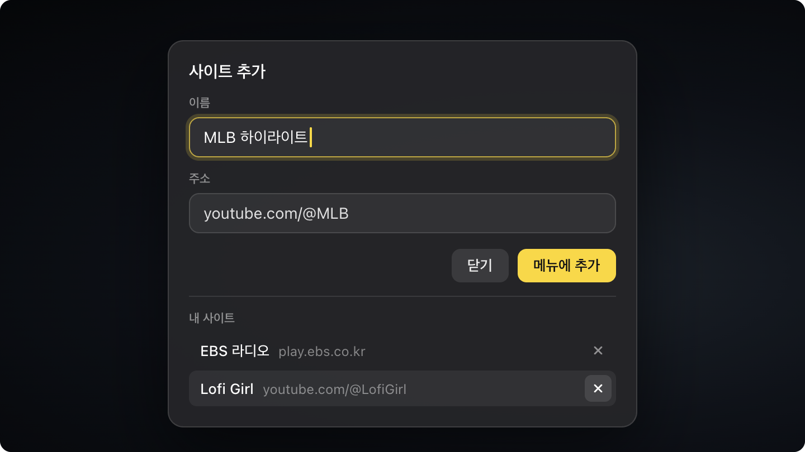

<div align="center">
  
  <h1>Peek</h1>
  <p><b>넷플릭스·유튜브를 항상 위에 띄워 두는 작은 창</b></p>

  <p>
    <a href="https://github.com/hoambaek/peek/releases/latest/download/Peek.dmg"></a>
    
    
    
    <a href="LICENSE"></a>
  </p>

  <p><a href="README.md">English</a> · <a href="#설치">설치</a> · <a href="#기능">기능</a> · <a href="#단축키">단축키</a> · <a href="#자주-묻는-질문">자주 묻는 질문</a></p>
</div>

<p align="center"></p>

일하면서 드라마·방송·강의를 화면 구석에 띄워 두세요. Peek은 Swift로 만든 맥 전용 앱(Electron 아님)입니다. 작은 웹 플레이어를 모든 창 위에 띄우고, 툴바는 필요할 때만 나타납니다.

## 작동 화면

<p align="center"><a href="docs/demo-ko.mp4"></a></p>
<p align="center"><sub>이미지를 누르면 고화질 영상(mp4)이 열립니다.</sub></p>

## 설치

1. 최신 릴리스에서 **[Peek.dmg](https://github.com/hoambaek/peek/releases/latest/download/Peek.dmg)** 를 받습니다.
2. 파일을 열고 **Peek** 을 **응용 프로그램(Applications)** 폴더로 끌어다 놓습니다.
3. 응용 프로그램 폴더에서 Peek을 실행합니다.

> [!IMPORTANT]
> Peek은 무료 앱이라 애플 공증을 받지 않았습니다. 그래서 처음 열 때 macOS가 막습니다.
> **시스템 설정 → 개인정보 보호 및 보안** 을 열고 아래로 내려 Peek 옆의 **그래도 열기** 를 누른 뒤 확인하세요.
> 한 번만 하면 됩니다.
>
> 터미널이 편하시면 `xattr -dr com.apple.quarantine /Applications/Peek.app` 으로 다운로드 표시를 지울 수 있습니다. 믿을 수 있는 앱에만 쓰세요.

Peek은 Dock 대신 메뉴막대에 있습니다. 메뉴막대 아이콘을 눌러 서비스를 바꾸거나 창을 다시 띄웁니다.

## 기능

- **항상 위에.** 다른 앱 위에 뜹니다. 설정하면 전체화면 앱 위에도 뜹니다.
- **기본 서비스.** Netflix·Disney+·Apple TV+·TVING·Wavve·쿠팡플레이·왓챠·라프텔·YouTube·Twitch·치지직을 바로 엽니다.
- **내 사이트.** 원하는 사이트를 원하는 이름으로 서비스 메뉴에 추가합니다.
- **주소 직접 열기**(⌘L). 주소 칸 아래에 최근 연 주소가 보입니다.
- **가리지 않는 툴바.** 마우스가 창 맨 위 끝에 닿을 때만 나타나, 사이트의 로그인 버튼 같은 것을 가리지 않습니다.
- **영상만 채우기**(⌘E). 사이트가 전체화면을 요청해도 Peek 창 안에서만 꽉 채웁니다.
- **투명도** 100%~40%.
- **광고 차단**(YouTube·Twitch). 메뉴막대에서 끌 수 있습니다.
- **모두 기억.** 창 위치·크기·투명도·마지막 페이지·로그인을 기억합니다.
- **한국어·영어.** 맥 언어 설정을 따릅니다.

<table>
  <tr>
    <td></td>
    <td></td>
  </tr>
  <tr>
    <td></td>
    <td></td>
  </tr>
</table>

## 단축키

| 단축키 | 동작 |
|---|---|
| ⌘L | 주소 열기 |
| ⌘E | 영상만 채우기 / 원래대로 |
| ⌘T | 항상 위 켜기·끄기 |
| ⌘R | 새로고침 |
| ⌘W | 창 숨기기 (메뉴막대에서 다시 열기) |
| 툴바 끌기 | 창 옮기기 |

## 자주 묻는 질문

**어떤 서비스가 재생되나요?**
Peek은 Safari 엔진(WebKit)으로 동작합니다. Safari에서 재생되는 서비스는 Peek에서도 재생됩니다. 넷플릭스·티빙은 실제 재생까지 확인했습니다. 크롬 전용 DRM(Widevine)만 쓰는 서비스는 재생되지 않습니다.

**넷플릭스가 4K로 안 나와요.**
Peek은 Safari의 재생 규칙을 따릅니다. 넷플릭스는 이런 웹 플레이어에 4K를 보내지 않습니다.

**「Peek WebCrypto Master Key」에 암호를 묻는 창이 떠요.**
스트리밍 사이트가 쓰는 Peek 자신의 암호화 열쇠입니다. 맥 로그인 암호를 넣고 **항상 허용** 을 누르세요.

**지우려면 어떻게 하나요?**
메뉴막대에서 Peek을 종료하고, 응용 프로그램 폴더에서 휴지통으로 옮기면 됩니다.

## 직접 빌드하기

```sh
git clone https://github.com/hoambaek/peek.git
cd peek
./build.sh            # build/Peek.app (유니버설)
open build/Peek.app
./release.sh          # dist/Peek-<버전>.dmg (`brew install create-dmg` 필요)
```

Xcode 프로젝트도, 외부 라이브러리도 없습니다. `swiftc`로 바로 빌드합니다. 내부 구조 설명은 [docs/DEVELOPMENT.md](docs/DEVELOPMENT.md)에 있습니다.

## 출처

히어로 이미지 속 장면은 Blender Foundation의 **Spring**(2019) 한 장면입니다. Wikimedia Commons에 CC0로 공개되어 있습니다.
작동 영상 속 장면도 **Spring**(© Blender Foundation, [CC BY 4.0](https://creativecommons.org/licenses/by/4.0/))에서 가져왔습니다.
Peek은 앱에서 여는 스트리밍 서비스들과 관계가 없습니다. 각 서비스 이름은 해당 회사의 것입니다.

## 라이선스

[MIT](LICENSE)
