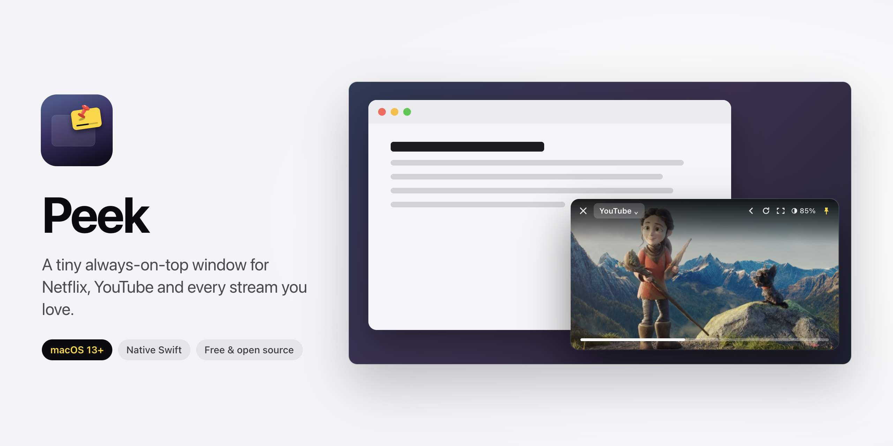
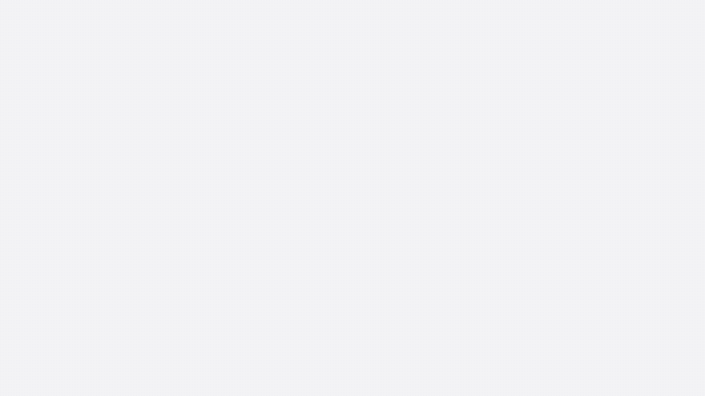
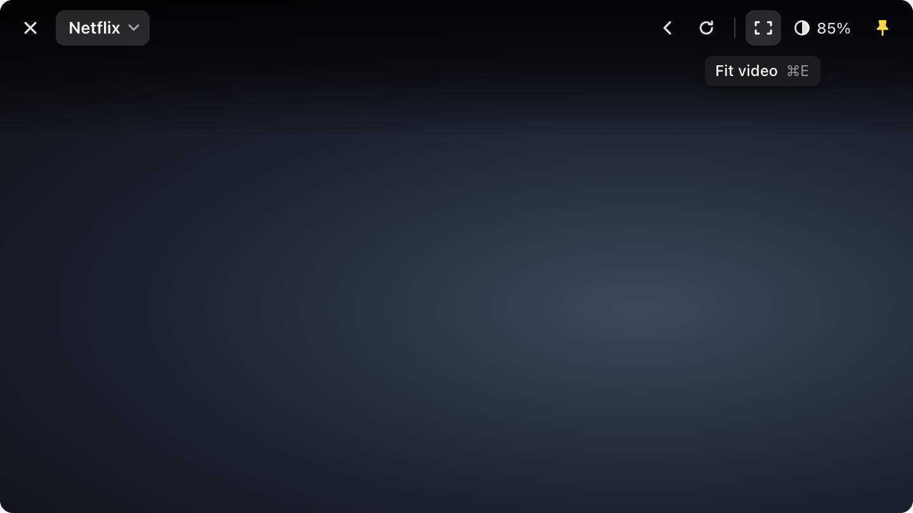
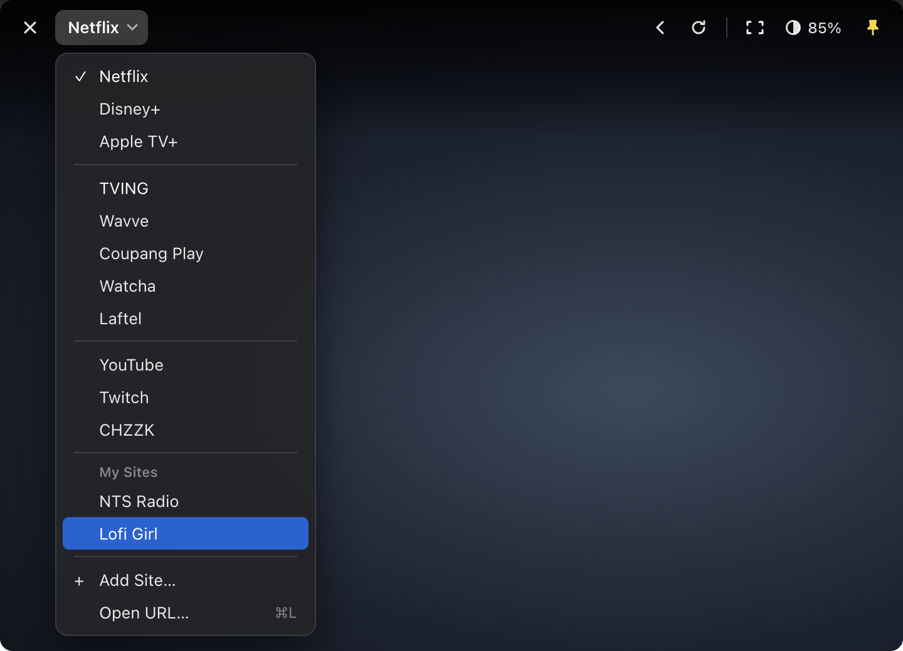
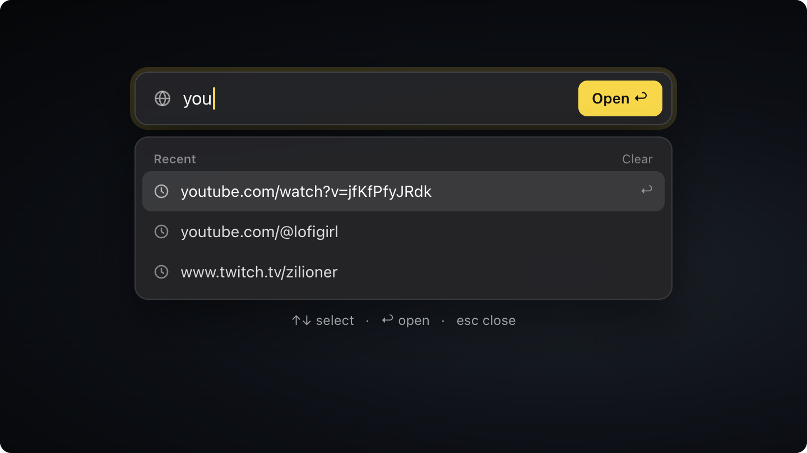
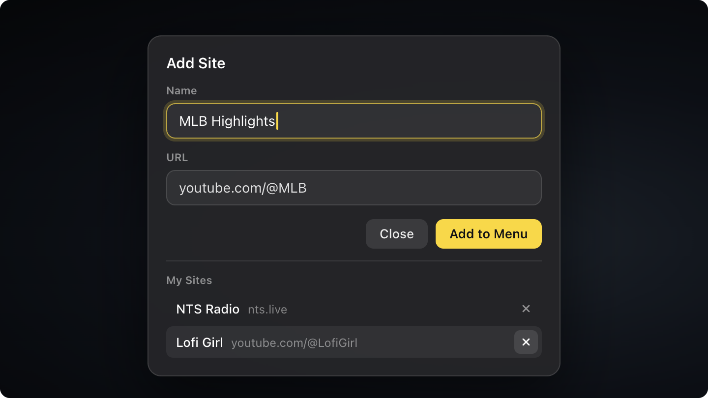

<div align="center">
  
  <h1>Peek</h1>
  <p><b>A tiny always-on-top window for Netflix, YouTube and every stream you love.</b></p>

  <p>
    <a href="https://github.com/hoambaek/peek/releases/latest/download/Peek.dmg"></a>
    
    
    
    <a href="LICENSE"></a>
  </p>

  <p><a href="README.ko.md">한국어</a> · <a href="#install">Install</a> · <a href="#features">Features</a> · <a href="#shortcuts">Shortcuts</a> · <a href="#faq">FAQ</a></p>
</div>

<p align="center"></p>

Keep a show, a stream or a lecture in the corner while you work. Peek is a native Swift app (no Electron) that floats a small web player above every other window, with a toolbar that stays out of the way until you reach for it.

## See it in action

<p align="center"><a href="docs/demo-en.mp4"></a></p>
<p align="center"><sub>Click the animation for the full-quality video (mp4).</sub></p>

## Install

1. Download **[Peek.dmg](https://github.com/hoambaek/peek/releases/latest/download/Peek.dmg)** from the latest release.
2. Open it and drag **Peek** onto **Applications**.
3. Launch Peek from Applications.

> [!IMPORTANT]
> Peek is free and not notarized by Apple, so macOS blocks it the first time.
> Open **System Settings → Privacy & Security**, scroll down and click **Open Anyway** next to Peek, then confirm.
> You only need to do this once.
>
> Prefer Terminal? `xattr -dr com.apple.quarantine /Applications/Peek.app` removes the download flag. Only do this for apps you trust.

Peek lives in the menu bar (no Dock icon). Click the menu bar icon to switch services or show the window again.

## Features

- **Always on top.** Floats above other apps, and optionally above full-screen apps too.
- **Built-in services.** Netflix, Disney+, Apple TV+, TVING, Wavve, Coupang Play, Watcha, Laftel, YouTube, Twitch and CHZZK, one click away.
- **My Sites.** Add any site to the service menu under a name you choose.
- **Open any URL** with ⌘L, with your recent addresses listed right below the field.
- **Out-of-the-way toolbar.** It appears only when the pointer touches the top edge, so it never covers a site's own buttons.
- **Fit video to window** (⌘E): the player fills the floating window, even when the site asks for full screen.
- **Opacity** from 100% down to 40%.
- **Ad blocking** for YouTube and Twitch (can be turned off in the menu bar).
- **Remembers everything**: window position, size, opacity, last page and your logins.
- **English and Korean**, following your macOS language.

<table>
  <tr>
    <td></td>
    <td></td>
  </tr>
  <tr>
    <td></td>
    <td></td>
  </tr>
</table>

## Shortcuts

| Shortcut | Action |
|---|---|
| ⌘L | Open a URL |
| ⌘E | Fit video to window / restore |
| ⌘T | Keep on top on / off |
| ⌘R | Reload |
| ⌘W | Hide the window (bring it back from the menu bar) |
| Drag the toolbar | Move the window |

## FAQ

**Which services play?**
Peek is built on Safari's engine (WebKit), so anything that plays in Safari plays in Peek. Netflix and TVING have been tested end to end. Services that only support Chrome's DRM (Widevine) will not play.

**Why is Netflix not in 4K?**
Peek follows Safari's playback rules, and Netflix does not serve 4K to this kind of web player.

**macOS asks for my password to use "Peek WebCrypto Master Key".**
That is Peek's own encryption key that streaming sites use. Enter your Mac login password and choose **Always Allow**.

**How do I uninstall?**
Quit Peek from the menu bar and move it from Applications to the Trash.

## Build from source

```sh
git clone https://github.com/hoambaek/peek.git
cd peek
./build.sh            # build/Peek.app (universal)
open build/Peek.app
./release.sh          # dist/Peek-<version>.dmg (needs `brew install create-dmg`)
```

No Xcode project and no dependencies; `swiftc` builds it directly. Notes on the internals (in Korean) are in [docs/DEVELOPMENT.md](docs/DEVELOPMENT.md).

## Credits

The scene inside the hero image is from **Spring** (2019) by the Blender Foundation, shared on Wikimedia Commons under CC0.
The demo video also uses footage from **Spring** (© Blender Foundation, [CC BY 4.0](https://creativecommons.org/licenses/by/4.0/)).
Peek is not affiliated with any of the streaming services it opens; their names belong to their owners.

## License

[MIT](LICENSE)
